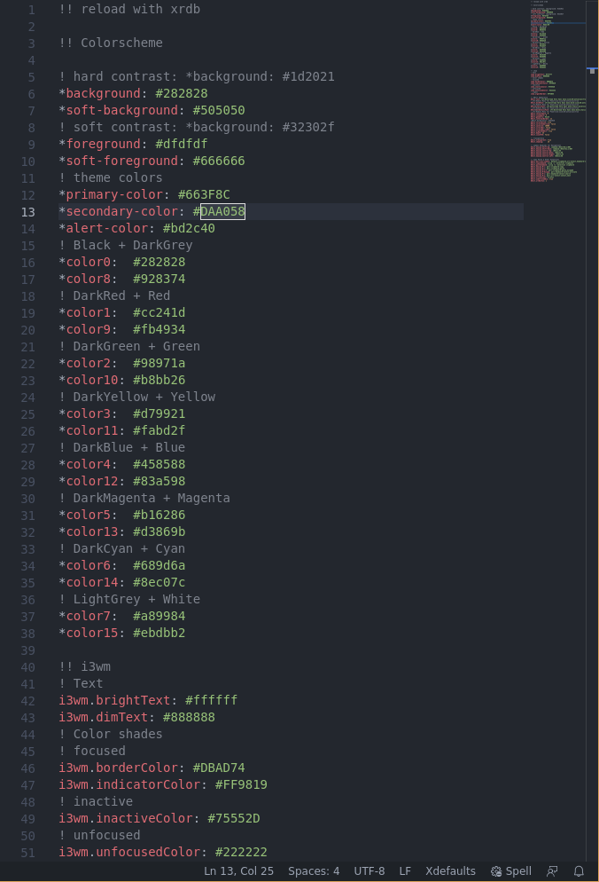

# xresources README

Xresources offers syntax highlighting for .Xresources and other similar files.

## Features

Introduces a new syntax highlighting named Xdefaults:

## Release Notes

### 1.0.0

Initial release of Xresources
